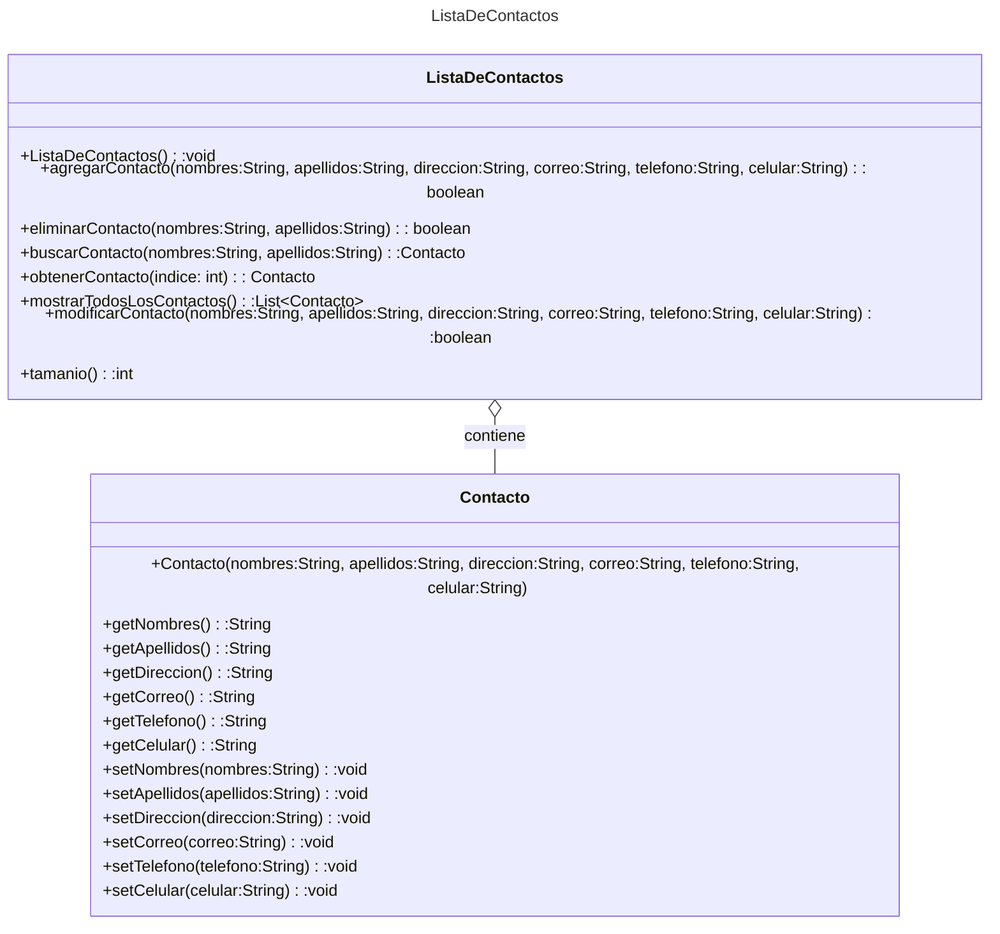

# Proyecto - Aplicación de Lista de Contactos Personales #

## Descripción del Problema ##
Este proyecto consiste en implementar una aplicación de Lista de Contactos Personales. El objetivo es crear una lista de contactos utilizando una estructura de datos llamada Lista. Esta lista permitirá almacenar y gestionar los contactos de manera eficiente.

La solución propuesta utiliza la clase Lista, que es una implementación de una lista enlazada. La lista enlazada está compuesta por nodos, donde cada nodo contiene un valor y una referencia al siguiente nodo. La clase Lista proporciona métodos para agregar, remover, insertar y acceder a los elementos de la lista.

## Funcionalidades Implementadas ##
1. Agregar un contacto a la lista.
2. Remover un contacto de la lista.
3. Insertar un contacto en una posición específica de la lista.
4. Obtener el valor de un contacto en una posición específica de la lista.
5. Obtener el tamaño de la lista.
6. Verificar si la lista está vacía.
7. Limpiar la lista, eliminando todos los contactos.
8. Validar que no se puedan agregar contactos con campos vacios
9. Validar que no se puedan modificar contactos con campos vacios

## Uso del Proyecto ##
El proyecto se puede compilar, probar y ejecutar utilizando los siguientes comandos:

make: Compila, prueba y ejecuta la aplicación.
make compile: Compila la aplicación.
make test: Ejecuta las pruebas unitarias.
make run: Ejecuta la aplicación.
make clean: Limpia los archivos binarios generados.
Contribución al Repositorio
Para contribuir al repositorio, se deben seguir los siguientes pasos:

Realizar los cambios necesarios en los archivos.
Agregar los cambios al área de preparación utilizando el comando git add ..
Hacer un commit de los cambios con un mensaje descriptivo utilizando el comando git commit -m "Descripción del cambio".
Enviar los cambios al repositorio remoto utilizando el comando git push origin main.


#### Este ejercicio implementa ####
      Una lista de contactos, utilizando nuestra clase Lista
      

## III LISTAS ###
1.  Nuestra propia estructura *Lista*
Es una colección de elementos homogéneos, con una relación lineal entre sus elementos. Esto es, cada elemento tiene un predecesor (excepto el primero) y un sucesor (excepto el último). El orden de los elementos afecta la función de acceso.
Se estudiarán las listas simples, listas dobles, listar circulares simples y listas circulares dobles
   

## Diagrama de clase Lista



[Editor en línea](https://mermaid.live/)

[Referencia-Mermaid](https://mermaid.js.org/syntax/classDiagram.html)

## Diagrama de clases UML con draw.io
El repositorio está configurado para crear Diagramas de clases UML con ```draw.io```. Para usarlo simplemente agrega un archivo con extensión ```.drawio.png```, das doble clic sobre el mismo y se activará el editor ```draw.io``` incrustado en ```VSCode``` para edición. Asegúrate de agregar las formas UML en el menú de formas del lado izquierdo (opción ```+Más formas```).


## Uso del proyecto con make

### Default - Compilar+Probar+Ejecutar
```
make
```
### Compilar
```
make compile
```
### Probar todo
```
make test
```
### Ejecutar App
```
make run
```
### Limpiar binarios
```
make clean
```
## Comandos Git-Cambios y envío a Autograding

### Por cada cambio importante que haga, actualice su historia usando los comandos:
```
git add .
git commit -m "Descripción del cambio"
```
### Envíe sus actualizaciones a GitHub para Autograding con el comando:
```
git push origin main
```
## Comandos individuales
### Compilar

```
find ./ -type f -name "*.java" > compfiles.txt
javac -encoding utf-8 -d bin -cp lib/junit-platform-console-standalone-1.5.2.jar @compfiles.txt
```
### Ejecutar ambos comandos en 1 sólo paso:
```
find ./ -type f -name "*.java" > compfiles.txt ; javac -encoding utf-8 -d bin -cp lib/junit-platform-console-standalone-1.5.2.jar @compfiles.txt
```

### Ejecutar Todas la pruebas locales de 1 Test Case
```
java -jar lib/junit-platform-console-standalone-1.5.2.jar -class-path bin --select-class miTest.AppTest
```
### Ejecutar 1 prueba local de 1 Test Case
```
java -jar lib/junit-platform-console-standalone-1.5.2.jar -class-path bin --select-method miTest.AppTest#appHasAGreeting
```
### Ejecutar App
```
java -cp bin miPrincipal.Principal
```
Los comandos anteriores están considerados para un ambiente Linux. [Referencia.](https://www.baeldung.com/junit-run-from-command-line)